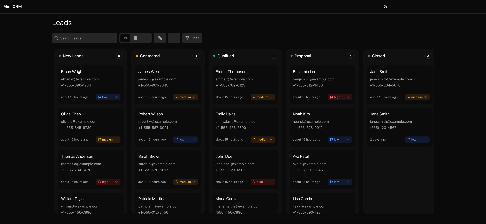

# 🚀 Mini CRM


<div align="center">
  
  <h3>A lightweight, elegant CRM system for managing your leads with ease</h3>
</div>

---

## ✨ Overview

Mini CRM is a sleek, modern customer relationship management system designed for simplicity and efficiency. It provides a beautiful interface for tracking leads, visualizing your sales pipeline, and managing customer interactions—all without the complexity of traditional CRM software.

<div align="center">
  
</div>

## 🔥 Key Features

- **📊 Dynamic Leads Dashboard**: View and manage all your leads from a clean, intuitive dashboard
- **📱 Responsive Design**: Works beautifully on desktop, tablet, and mobile devices
- **🔄 Kanban Board**: Drag-and-drop leads through your sales pipeline stages
- **📝 Contact Management**: Store and access lead information in one place
- **🔍 Search & Filter**: Quickly find leads by name, status, priority, etc.
- **📈 Lead Prioritization**: Categorize leads by priority (high, medium, low)
- **🌈 Visual Status Tracking**: Track lead status with customizable columns
- **📅 Activity History**: Monitor all changes and interactions with each lead
- **🌙 Dark Mode**: Easy on the eyes at night

## 🔧 Technologies

- **Next.js** - React framework for building the UI
- **TypeScript** - Type safety and better developer experience
- **Supabase** - Backend database and authentication
- **Tailwind CSS** - For styling and responsive design
- **shadcn/ui** - UI component library
- **Canvas API** - For the animated grid background

## 🚀 Getting Started

### Prerequisites

- Node.js (v16 or later)
- npm or yarn

### Installation

1. Clone the repository:
   ```bash
   git clone https://github.com/sadafsajju/mini.git
   cd mini-crm
   ```

2. Install dependencies:
   ```bash
   npm install
   # or
   yarn install
   ```

3. Set up environment variables:
   Create a `.env.local` file in the root directory with the following variables:
   ```
   NEXT_PUBLIC_SUPABASE_URL=your_supabase_url
   NEXT_PUBLIC_SUPABASE_ANON_KEY=your_supabase_anon_key
   ```

4. Start the development server:
   ```bash
   npm run dev
   # or
   yarn dev
   ```

5. Open [http://localhost:3000](http://localhost:3000) in your browser to see the application.

## 🖥️ Usage

### Managing Leads

1. **View Leads**: Navigate to the Leads page to see all your current leads
2. **Add New Leads**: Click the "Add Lead" button to create a new lead entry
3. **Edit Leads**: Click the pencil icon on any lead to edit its details
4. **Change Status**: Use the status dropdown to move leads through your pipeline
5. **Set Priority**: Assign high, medium, or low priority to each lead
6. **View History**: Click the history icon to view all changes made to a lead

### Visualization Options

- **List View**: Detailed table view with all lead information
- **Grid View**: Card-based layout for a more visual representation
- **Kanban View**: Drag-and-drop interface for pipeline management

## 🌟 Features in Detail

### Beautiful Animated Background

The homepage features a stunning animated grid background with flowing energy beams that:
- Pulse gently to create an organic, living feel
- Flow toward the center, representing data moving through your system
- Fade elegantly as they approach the center
- Travel along grid lines with varying trail lengths
- Appear and disappear randomly to create visual interest

### Lead Management

- **Complete Contact Info**: Store name, email, phone, address, and notes
- **Custom Status Tracking**: Define your own pipeline stages
- **Activity Timeline**: Chronological history of all lead interactions and changes
- **Notes & Comments**: Add detailed notes to each lead for future reference

### User Interface

- **Responsive Design**: Works on screens of all sizes
- **Intuitive Navigation**: Easy access to all features with minimal clicks
- **Visual Feedback**: Color-coded indicators for priority and status
- **Dark & Light Modes**: Choose your preferred theme

## 📈 Future Enhancements

- Email integration for direct communication
- Calendar integration for scheduling meetings
- Task management and reminders
- Advanced reporting and analytics
- Team collaboration features

## 🤝 Contributing

Contributions are welcome! Please feel free to submit a Pull Request.

1. Fork the repository
2. Create your feature branch (`git checkout -b feature/amazing-feature`)
3. Commit your changes (`git commit -m 'Add some amazing feature'`)
4. Push to the branch (`git push origin feature/amazing-feature`)
5. Open a Pull Request

## 📄 License

This project is licensed under the MIT License - see the LICENSE file for details.

---

<div align="center">
  <p>Made with ❤️ by 🤖 for efficiency and simplicity</p>
</div>
